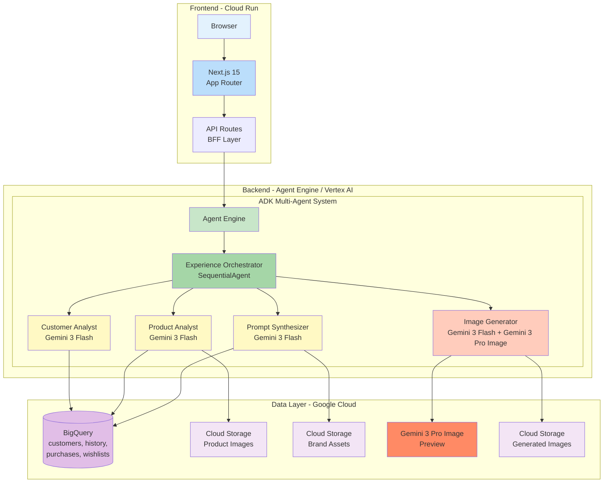
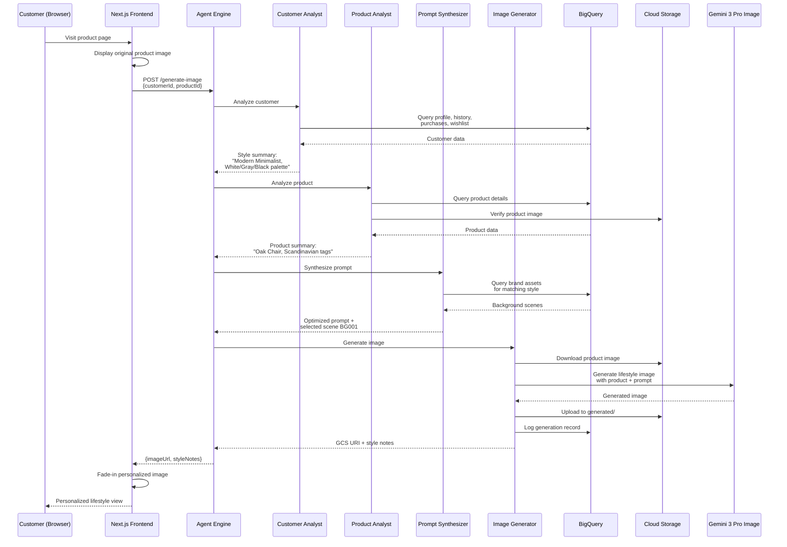

# The Contextual Image Agent

AI-powered multi-agent system that dynamically generates personalized product images tailored to each customer's unique style preferences, revolutionizing the online e-commerce shopping experience.

## Business Value

### Problem
Static, one-size-fits-all product photos fail to connect with a diverse customer base. Shoppers see generic products in generic settings, creating a "visualization gap" - the inability to envision products as part of their home and lifestyle. This leads to high bounce rates, low engagement, and lost revenue.

### Solution
The Contextual Image Agent analyzes each customer's browsing history, purchase patterns, and style preferences to generate personalized lifestyle images in real-time. When a customer views a product, the system:

1. **Analyzes** their unique style profile (Modern Minimalist, Industrial, Bohemian, Japandi, Coastal Living)
2. **Selects** the most appropriate background scene from the brand asset library
3. **Generates** a photorealistic lifestyle image placing the product in the customer's preferred aesthetic context

### Expected Impact
- **10% increase** in e-commerce conversion rates
- **Significantly higher** customer engagement and time-on-page
- **Reduced** bounce rates on product pages
- **Personalized** shopping experience at scale

## Architecture



## Processing Flow



## Tech Stack

| Component | Technology |
|-----------|-----------|
| Frontend | Next.js 15 (App Router, TypeScript, Tailwind CSS) |
| Frontend Hosting | Cloud Run |
| Backend | ADK (Agent Development Kit) - Python |
| Backend Hosting | Agent Engine (Vertex AI) |
| Orchestration LLM | Gemini 3 Flash Preview |
| Image Generation | Gemini 3 Pro Image Preview |
| Structured Data | BigQuery |
| Unstructured Data | Cloud Storage |
| GCP Project | `tactile-octagon-372414` |

## Agent System Design

### Experience Orchestrator (Root - SequentialAgent)
Coordinates the 4 sub-agents in sequence, passing data through shared session state.

### Customer Analyst (LlmAgent)
Queries BigQuery for customer profile, browsing history, purchases, and wishlist. Produces a style preference summary.

### Product Analyst (LlmAgent)
Retrieves product details and verifies product image availability in Cloud Storage.

### Prompt Synthesizer (LlmAgent)
Combines customer preferences with product details to create an optimized image generation prompt, selecting the best matching brand asset background.

### Image Generator (LlmAgent)
Calls Gemini 3 Pro Image API with the synthesized prompt and product image to generate a personalized lifestyle photograph. Uploads the result to Cloud Storage.

## Data Schema (BigQuery)

**Dataset**: `contextual_image_agent`

| Table | Description | Records |
|-------|-------------|---------|
| `customers` | Customer profiles with style preferences | 5 |
| `browsing_history` | Product page views with duration | 35 |
| `purchases` | Purchase records | 11 |
| `wishlists` | Wishlist items | 12 |
| `products` | Product catalog with images | 10 |
| `brand_assets` | Background scene definitions | 5 |
| `generated_images` | Cache of generated images | Dynamic |

## Sample Personas

| Customer | Style | Preferred Colors |
|----------|-------|-----------------|
| Mia Tanaka | Modern Minimalist | White, Gray, Black |
| Ken Yamada | Industrial | Dark Wood, Metal, Black |
| Hana Sato | Bohemian | Terracotta, Mustard, Olive |
| Ichiro Suzuki | Japandi | Natural Wood, Indigo, White |
| Emily Chen | Coastal Living | White, Light Blue, Sand |

## Project Structure

```
contextual-image-agent/
├── README.md
├── implementation_plan.md
├── frontend/                     # Next.js 15 application
│   ├── src/
│   │   ├── app/                  # App Router pages & API routes
│   │   ├── components/           # React components
│   │   └── lib/                  # BigQuery, GCS, Agent Engine clients
│   └── package.json
├── backend/                      # ADK agent system
│   ├── app/
│   │   ├── agent.py              # Root SequentialAgent
│   │   ├── config.py             # Configuration constants
│   │   ├── agents/               # Sub-agent definitions
│   │   └── tools/                # BigQuery, GCS, image gen tools
│   ├── pyproject.toml
│   └── deploy_agent_engine.py
└── scripts/
    ├── setup_bigquery.py         # Create dataset/tables + seed data
    ├── setup_gcs.py              # Create GCS bucket
    └── generate_images.py        # Generate product & brand asset images
```

## Setup & Deployment

### Prerequisites
- Google Cloud project with billing enabled
- `gcloud` CLI authenticated
- `uv` (Python package manager)
- `node` / `npm`

### 1. Infrastructure Setup
```bash
cd contextual-image-agent
uv run python scripts/setup_gcs.py
uv run python scripts/setup_bigquery.py
uv run python scripts/generate_images.py
```

### 2. Backend (Agent Engine)
```bash
cd backend
uv sync
uv run adk deploy agent_engine --project=tactile-octagon-372414 --region=us-central1 app/
```

### 3. Frontend (Cloud Run)
```bash
cd frontend
npm install
AGENT_ENGINE_RESOURCE_ID=<resource_id> npm run build
gcloud run deploy contextual-image-frontend \
  --source . \
  --region us-central1 \
  --set-env-vars AGENT_ENGINE_RESOURCE_ID=<resource_id>,AGENT_ENGINE_LOCATION=us-central1 \
  --allow-unauthenticated
```

## Future Enhancements
- Product recommendation based on customer preferences
- Agent Engine Memory Bank for persistent personalization
- A/B testing framework for conversion rate measurement
- Batch pre-generation of popular product/customer combinations
